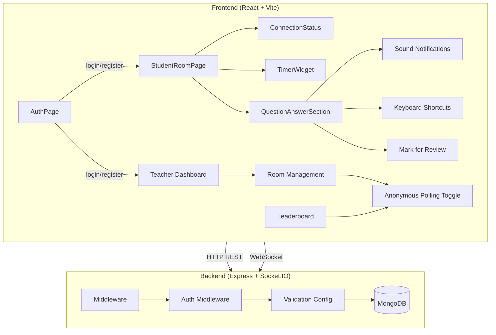

# UX Improvements & Architecture Enhancements

## Feature Comparison: Before vs After

```mermaid
flowchart LR
    subgraph BEFORE["Before"]
        A1[Basic Auth]
        A2[Room Management]
        A3[AI Question Gen]
        A4[Real-time Polling]
        A5[Leaderboard]
        A6[Timer]
    end

    subgraph AFTER["After"]
        B1[Basic Auth ✓]
        B2[Room Management ✓]
        B3[AI Question Gen ✓]
        B4[Real-time Polling ✓]
        B5[Leaderboard ✓]
        B6[Timer ✓]
        B7[Sound Notifications ✨]
        B8[Keyboard Shortcuts ✨]
        B9[Mark for Review ✨]
        B10[Anonymous Polling ✨]
        B11[Env Validation ✨]
        B12[Component Refactoring ✨]
    end

    BEFORE -->|"+6 new features"| AFTER
```



---

## Detailed Breakdown

| Feature | Before | After |
|---------|--------|-------|
| **Sound Notifications** | ❌ None | ✅ Question arrival, answer submit, timer warning sounds via Web Audio API |
| **Keyboard Shortcuts** | ❌ None | ✅ 1-4 (select), Space (mark review), Enter (submit), L (leaderboard), M (mute) |
| **Mark for Review** | ❌ None | ✅ Flag questions with orange visual indicator |
| **Anonymous Polling** | ❌ All names visible | ✅ Toggle in Room Settings to hide names on leaderboard |
| **Environment Validation** | ❌ None / hardcoded fallbacks | ✅ Zod schema validation for all env vars |
| **Auth Middleware** | `process.env.JWT_SECRET \|\| 'hardcoded-fallback'` | ✅ Imported from validated config |
| **MongoDB Setup** | Required system MongoDB install | ✅ `mongodb-memory-server` — zero config local dev |
| **Component Architecture** | Monolithic `StudentRoomPage.jsx` | ✅ Extracted: `ConnectionStatus`, `TimerWidget`, `QuestionAnswerSection` |
| **Routing** | Hardcoded `/spandan` basename | ✅ Dynamic from `VITE_BASE_PATH` env var |
| **API URL Config** | Hardcoded paths | ✅ Centralized in `frontend/.env` |
| **ES Module Compatibility** | Mixed CJS/ESM imports | ✅ All imports use ES module syntax |

---

## Architecture Diagram



---

## File Map

| Layer | File | Purpose |
|-------|------|---------|
| **Sounds** | `frontend/src/services/soundService.js` | Web Audio API sound engine |
| **Shortcuts** | `frontend/src/hooks/useKeyboardShortcuts.js` | Global keyboard bindings |
| **Review** | `frontend/src/pages/StudentRoomPage.jsx` | Mark-for-review state & UI |
| **Anon** | `frontend/src/components/Modals/RoomSettingsModal.jsx` | Anonymous toggle |
| **Anon** | `frontend/src/components/Leaderboard/Leaderboard.jsx` | Respects anonymity flag |
| **Components** | `frontend/src/components/ConnectionStatus.jsx` | Extracted connection indicator |
| **Components** | `frontend/src/components/TimerWidget.jsx` | Extracted countdown timer |
| **Components** | `frontend/src/components/QuestionAnswerSection.jsx` | Extracted Q&A panel |
| **Validation** | `backend/src/validation/configValidation.js` | Zod env schema |
| **Config** | `frontend/.env` | Centralized frontend env vars |
| **Config** | `backend/.env.example` | Backend env template |
| **Config** | `frontend/src/config.js` | Frontend feature flags |
| **Dev** | `scripts/start-mongodb.js` | In-memory MongoDB launcher |
| **Dev** | `package.json` | Added `mongodb-memory-server` dep |

---

## Quick Start (Dev)

```bash
# Terminal 1 — Database
node scripts/start-mongodb.js

# Terminal 2 — Backend (port 3001)
node backend/src/index.js

# Terminal 3 — Frontend (port 5173)
cd frontend && npx vite

# Open → http://localhost:5173/spandan/
```
